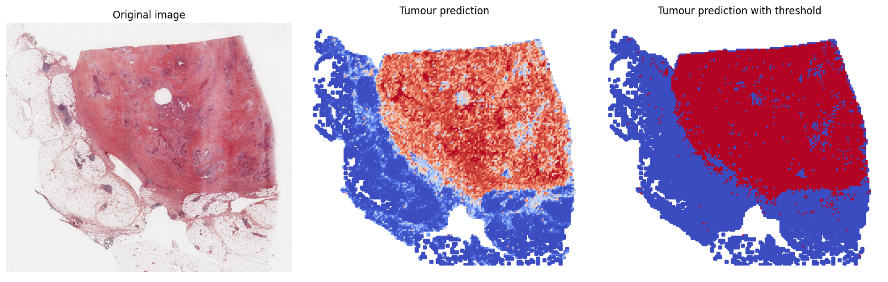

# PACPaint Neo

This repository contains the code for the PACPaint Neo model. This model is a deep learning model that predicts the molecular subtypes of pancreatic adenocarcinoma from histopathological images. The model predicts for all tissue tiles of a WSI its probability to be neoplasic.
This package implement the model described in [1] using the backbone of [2].

## Installation

To utilise the package, you need to download the code from this repository. You can do this by using the following command:

```bash
git clone https://github.com/GeNeHetX/PACPaint_Neo.git
```

Then, you need to install the required packages. 
First, having OpenSlide is mandatory. Considerer visiting [their website](https://openslide.org/download/). In short for Linux users, choose the command corresponding to your distro. For windows users, download the Windows 64-bit Binaries and follow [these insctructions](https://openslide.org/api/python/). You will have to change the value of `OPENSLIDE_PATH` in python files. I suggest using Linux or WSL.
Then to install the required packages, you can use the following command:

```bash
pip install -r requirements.txt
```

## Usage

To use the model, you can use the following code:

```bash
usage: process_wsi.py [-h] --temp_dir TEMP_DIR [--wsi WSI] [--neo NEO] [--device {cuda:0,cpu}]
                      [--batch_size BATCH_SIZE] [--num_workers NUM_WORKERS] [--prefetch_factor PREFETCH_FACTOR]
                      [--pred_threshold PRED_THRESHOLD] [--display]
```

Where:
- `--temp_dir` is the directory where the temporary files will be stored.
- `--wsi` is the path to the WSI. It accepts ".svs", ".ndpi" and ".qptiff" files. More formats can be added in the `extract_features.py` and `extract_tiles.py` files.
- `--neo` is the path to the pretrained neoplasic detection model. The model is to be found in `src/models/model_neo.path`.
<!-- - `--comp` is the path to the pretrained molecular subtype prediction model.  This feature is not really working well-->
- `--device` is the device to use for the prediction. It can be "cuda" or "cpu" if you don't have a GPU. default is "cuda".
- `--batch_size` is the batch size to use for the prediction.
- `--num_workers` is the number of workers to use for the prediction. If on Windows, it should be set to 0.
- `--prefetch_factor` is the prefetch factor to use for the prediction. If on Windows, it should be set to `None`.
- `--pred_threshold` is the threshold to use for the prediction. By default, it is set to 0.5.
- `--display` is a flag to display the prediction in a separate window.

<!-- include the image in test folder -->
For example, you can use the following command to predict a WSI:

```bash
python process_wsi.py --temp_dir temp --wsi test/TCGA-2L-AAQ8-01Z-00-DX1.3A3E3A3E-3A3E-4A3E-8A3E-3A3E3A3E3A3E.svs --neo models/model_neo.pth --device cuda:0 --batch_size 16 --num_workers 4 --prefetch_factor 2 --pred_threshold 0.5 --display
```




## References
[1] Saillard, Charlie, Flore Delecourt, Benoit Schmauch, Olivier Moindrot, Magali Svrcek, Armelle Bardier-Dupas, Jean Francois Emile, et al. « Pacpaint: a histology-based deep learning model uncovers the extensive intratumor molecular heterogeneity of pancreatic adenocarcinoma ». Nature Communications 14 (13 juin 2023): 3459. https://doi.org/10.1038/s41467-023-39026-y.

[2] Kang, Mingu, Heon Song, Seonwook Park, Donggeun Yoo, et Sérgio Pereira. « Benchmarking Self-Supervised Learning on Diverse Pathology Datasets ». arXiv, 18 avril 2023. https://doi.org/10.48550/arXiv.2212.04690.
